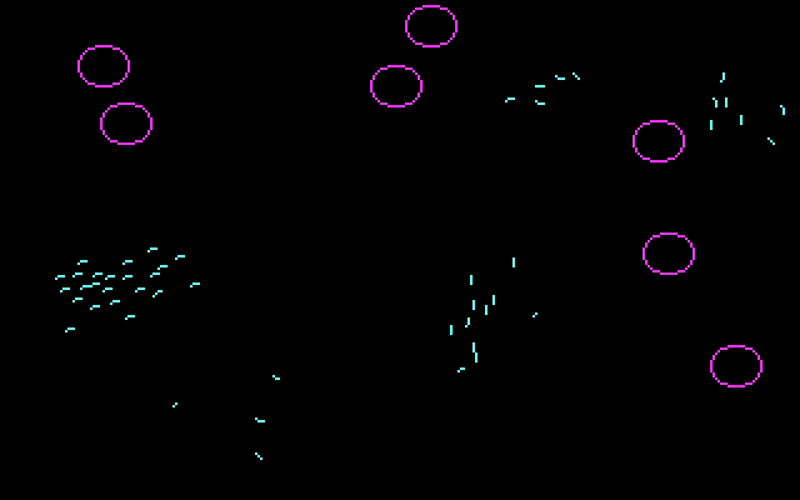
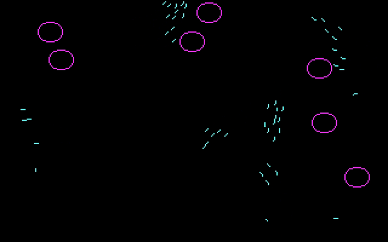
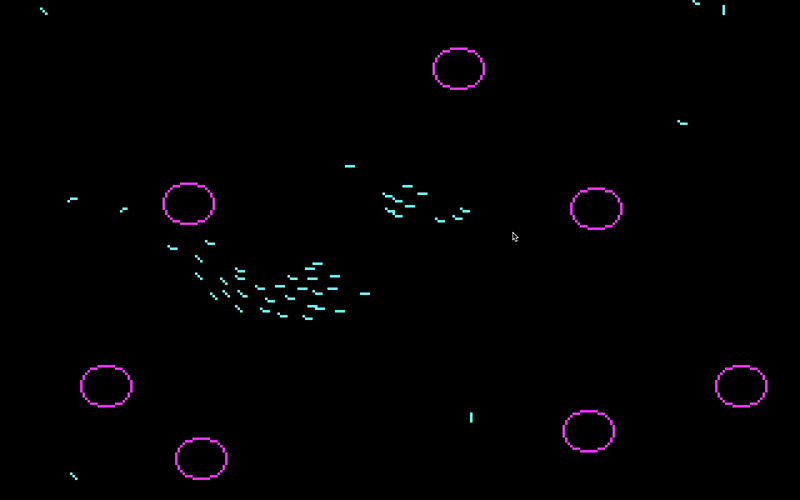

# QBasicBoids
This is a very simple implementation in **QBasic** of the artificial life algorithm **Boids** by **Craig Reynolds**. You can run this application executing the binary file BOIDS.EXE on a MS-DOS 6.22 or Windows system.

Alternatively you can also run this application via its source code using QBasic 1.1 or higher in a MS-DOS 6.22 system. The binary file in this repository has been created compiling the source code using QBasic 4.5.

